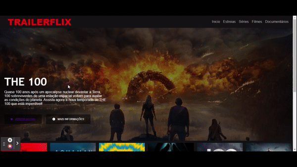
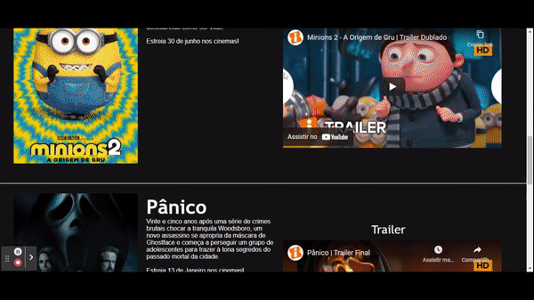

<h1 align="center" font-size="bold" color-font="red"> TrailerFlix </h1>

# Olá Devs

 
  Me chamo Leandro e esse projeto foi baseado e inspirado em clonar o site do Netflix.

  
  

# Resumo do projeto

  
  ``O TrailerFlix é uma página web que disponibiliza trailer de filmes, séries e inclusive estreias.``
  
  ``O usuário tem acesso a diversos filmes, series e documentários onde pode assistir trailers dos mesmos sem sair da página.
  Conta também com uma lista de filmes que irão estreiar em 2022 e nessa lista também tem acesso a sinopse e trailers.``

## 🔨 Funcionalidades do projeto

- `Funcionalidade 1` `Carrossel`: Carrossel na home com a capa dos principais filmes, séries e documentários da página.
- `Funcionalidade 2` `Trailers`: Trailers atualizados disponíveis para assistir na própria página.
- `Funcionalidade 3` `Estreias`: Lista com os principais filmes que irão estrear em 2022.
- `Funcionalidade 4` `Sinopse`: Sinopse de todos os filmes, series, documentários e inclusive das estreias.

## ✔️ Tecnologias utilizadas

- ``HTML5``
- ``CSS3``
- ``VS code``

## 💻 Acesse o site

